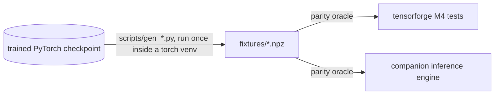

# tensorforge

A deep learning framework written from scratch: scalar autograd, NumPy
tensors, Transformer primitives, and a full training loop. The final proof is
specific. A real, already-trained GPT checkpoint was retrained on this engine,
and the numbers match PyTorch's, forward and backward. This is not a tutorial
reimplementation validated against itself.

## Why

To understand the engine underneath a framework like PyTorch, not just its
API: how gradients actually flow, where they accumulate, and how they go
wrong. Everything here exists because writing it was the point.

## Status

Closed at v1.0. 449 tests.

| Milestone | Scope | Proof |
|---|---|---|
| M0 | Scalar autograd: `Value`, computation graph, `backward()`; ops `+ * ** neg sub truediv relu tanh exp` | Every op gradchecked: numerical vs analytical gradient, not "it runs" |
| M1 | Tensor autograd over NumPy: per-node `_backward` closures, broadcasting, batched `matmul` | Gradients un-broadcast to input shapes; gradcheck on composed graphs, where the reduction bugs live |
| M2 | Modules and optimizers: `Linear`, `LayerNorm`, `SGD`, `Adam` | Layer-level gradcheck plus update-rule tests against hand-derived values |
| M3 | Transformer primitives: softmax, causal attention, embeddings, `GPT` assembly with weight tying | Composition tests on the full block, not isolated ops |
| M4 | Training loop: `cross_entropy`, `AdamW`, LR schedule, `clip_grad_norm_`, `train_step` | Numerical parity against a real trained checkpoint: logits, loss, gradients, and one optimizer step |

## Where this repo sits



The checkpoint and its training data are private and stay out of this repo.
The generators freeze real weights and reference inputs and outputs into
plain NumPy `.npz` files, once, inside the only environment that has torch.
From then on, two codebases test against those frozen numbers without ever
importing PyTorch: this one and a companion inference engine project.

## Engineering discipline

The same protocol on every cycle, all five milestones:

- The math a test checks is written down before the test, including its
  tolerance. Bounds are derived as `sqrt(K)·eps` accumulated over the
  contraction depth, not loosened until green. Measured errors came in one
  to two orders of magnitude below the derived bounds.
- TDD with red confirmed first. No implementation before a failing test.
- Gradcheck (numerical vs analytical) as each new operation lands, not one
  sweep at the end.
- Mutation testing per milestone: bugs deliberately introduced into
  "correct" code, line by line, to confirm the tests catch each one and do
  not pass by coincidence. This was done manually here, one milestone at a
  time. Surviving mutants were investigated and accepted only when provably
  equivalent. There is no aggregate mutant count because no central artifact
  exists to back one.
- An external oracle at the end. M4 validates against a checkpoint this
  codebase did not produce, not against references written here.

Measured parity, float64 on both sides:

| Quantity | Relative error vs PyTorch |
|---|---|
| Logits over a full real window | 2.7e-15 |
| Loss | 0.0 (exact) |
| Sampled gradients | 4.4e-15 to 1.1e-14 |
| One AdamW step from the real optimizer state | 0.0 to 2.5e-16 |
| `clip_grad_norm_` on real gradients | ~1e-15 |

The argmax is identical token for token across the whole window. One thing is
not reproduced, by principle rather than by bug: the original training
trajectory. That run was float32 on MPS; this is float64 in NumPy. The first
step differs by ~1e-7 and training amplifies the difference exponentially.
The validated target is the step, not the curve.

Some decisions only surfaced by reading the target's source instead of
assuming convention:

- The causal mask uses `-1e9`, not `-inf`. A fully masked row would produce
  `nan` in the softmax stability shift.
- `Linear` stores its weight `(in, out)` and the loader transposes. A
  forgotten transpose on the square attention projections changes no shape,
  so only value comparison catches it.
- Weight decay applies to every parameter, biases and LayerNorm gains
  included, because the target does not filter by ndim.
- The LR schedule is indexed so iteration *k* uses `lambda(k-1)`: the
  target's scheduler steps after the optimizer and advances once at
  construction. A corollary worth knowing: the lr recorded in a checkpoint
  was never used by any step. It is staged for the next one.
- Adam's `eps` sits outside the square root.
- No AMP and no gradient accumulation, because the reference run used
  neither.

## The finding: nondeterministic gradients from `set` iteration

The best bug this project surfaced was not in any formula.

`Tensor._prev`, each graph node's children, was stored in a Python `set`.
Iteration order over a set of objects follows hashes derived from `id()`,
which change between runs. So the reverse topological sort changed from run
to run, and with it the order in which `+=` accumulations landed in each
`.grad`. Floating-point addition is not associative. Two runs of identical
code on identical data produced gradients differing by about one ulp per
parameter.

No tolerance-based test could catch this. A ~1e-16 divergence sits far below
any reasonable `rtol`, so hundreds of `allclose` assertions kept passing
while the engine quietly produced different numbers every run. It surfaced
only when M4's validation demanded byte-for-byte equality between
`train_step` and the manual composition of its pieces, and that test failed.

The diagnosis ran before any fix. Running the same route twice on identical
models also diverged, which ruled out the new code and pointed at the engine.
Printing the topological order across two runs confirmed the instability.

The fix: `_prev` became a tuple, in both the tensor engine and the original
scalar engine. Duplicate children are harmless because the topo sort already
de-duplicates through its `visited` set, so `x + x` still accumulates twice.
The regression is pinned by tests that demand bit-identical gradients across
repeated runs.

The lesson: an exact-equality test found a defect that no `allclose` ever
would. Loose tolerances hide ordering bugs.

## M5 (MLX backend): declined

A GPU port via MLX was scoped and deliberately not built here. Two reasons.
Opportunity cost: other work mattered more at the time. Scope risk: an MLX
port done properly grows into a publishable package with CI, docs, and
bindings, which is a separate project rather than one more milestone. The
MLX forward port later happened where it belonged, in the companion inference
project. This is a decision, not a pending item.

## Current role: fixture generators

Beyond the training engine, this repo is the source of the fixture generators
consumed by both test suites in the diagram above. Each freezes one specific
behavior of the real checkpoint:

| Script | Freezes | Needs torch |
|---|---|---|
| `gen_parity_fixture.py` | Weights, a real input window, and reference logits/loss/gradients in float64. Run this first; the next two reuse its gradients | yes |
| `gen_adamw_fixture.py` | One real `torch.optim.AdamW` step from the checkpoint's optimizer state | yes |
| `gen_clip_fixture.py` | `clip_grad_norm_` outputs across three regimes plus the boundary case where the norm equals `max_norm` exactly | yes |
| `gen_generate_fixture.py` | Two greedy generations that stop on `max_new_tokens` | yes |
| `gen_eos_fixture.py` | A greedy generation that stops on a real EOS, the stop path the other fixture never exercises | yes |
| `gen_val_windows_fixture.py` | 16 real data windows for the training demo | no |

The generators are deterministic: regenerating produces byte-for-byte
identical files. Details, ordering, and the environment lookup are in
[`scripts/README.md`](scripts/README.md).

## Reproduction limits

The trained checkpoint is private and is not in this repo. The `.npz`
fixtures derived from it (~157 MB) are gitignored and were deliberately
removed from git history. Without them the parity layer skips itself rather
than failing: 428 passed, 21 skipped on a clean clone, via
`pytest.mark.skipif` with a message naming the generator to run. With the
fixtures present, all 449 run.

Everything that does not need the checkpoint runs anywhere: the autograd
engines, modules, optimizers, schedule, clipping, and their gradchecks.

## Running the tests

```bash
pip install -r requirements.txt
python -m pytest tests/ -v
```

`scripts/demo_train.py` (needs the fixtures) loads the real weights and
trains on this engine in two regimes: overfitting a single batch, the classic
gate that proves the engine learns, and a faithful continuation at the real
schedule, which proves it runs in the real regime.
